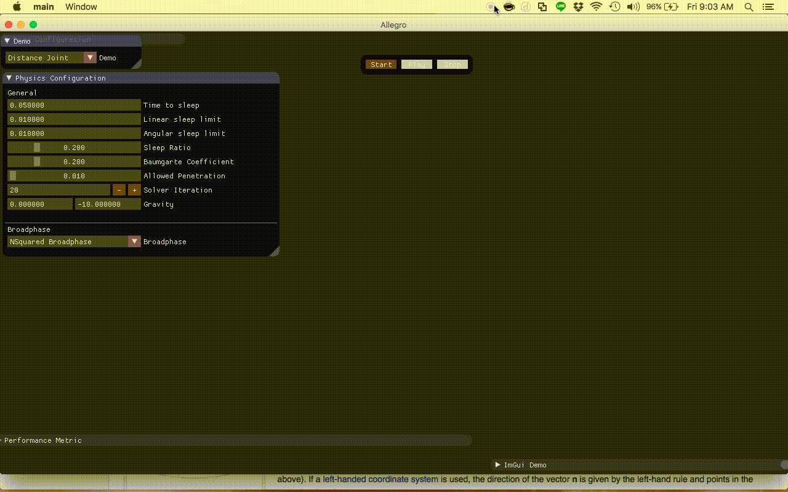
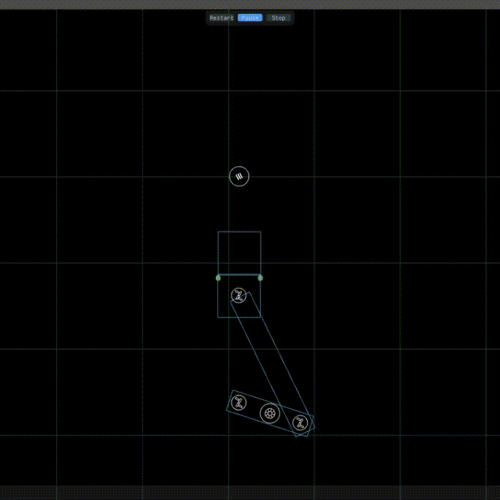

# What is Falton?
Falton is a 2D rigid body physics engine. What makes Falton different from another physics engine is that Falton let user to choose broadphase algorithm that suit their game. 
There are four broadphase algorithm in Falton2D currently. They are :
- Bounding Volume Hierarchy
- Uniform Grid
- Hierarchical Grid
- Quad Tree

# Current Feature
- Collision Filter
- Static, Dynamic, and Kinematic body
- Circle and Polygon Shape
- Region Query
- Various Joint : Hinge Joint, Spring Joint, Piston joint etc
- Body property : restitution and friction coefficient

# Further Work
- Internal memory allocation
- Chain shape
- Add more joint
- Raycast

# Demo

# Reference
- Box2D
- Chipmunk
- Bullet
